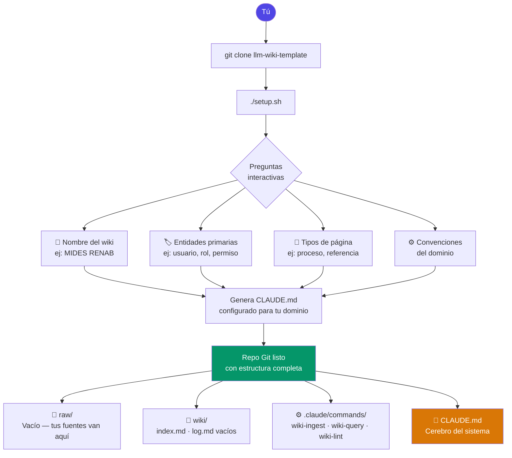

# llm-wiki-template

Template para crear wikis de conocimiento mantenidos por IA, basado en el patrón LLM Wiki de Karpathy (abril 2026).

**Un comando crea tu wiki. La IA lo mantiene. El conocimiento se acumula.**

---

## Cómo funciona

### Primera vez — Setup



---

### Flujo continuo — Agregar conocimiento y consultar


---

## Cuándo usar este patrón

✅ **Ideal para:**

- Documentación de sistemas internos (hasta ~200 artículos)
- Knowledge base de equipos pequeños (2-10 personas)
- Procesos, roles, permisos, manuales operativos
- Cualquier dominio donde el conocimiento se acumula con el tiempo

⚠️ **Considera RAG si:**

- Tienes miles de documentos que cambian constantemente
- Necesitas búsqueda semántica sobre texto libre masivo

---

## Estructura del template

```
llm-wiki-template/
├── README.md                  ← este archivo
├── setup.sh                   ← genera un wiki nuevo
├── CLAUDE.md.template         ← cerebro del sistema (con placeholders)
├── wiki/
│   ├── index.md               ← catálogo vacío
│   └── log.md                 ← log vacío
├── raw/
│   └── .gitkeep
└── .claude/
    └── commands/
        ├── wiki-ingest.md     ← skill: procesar fuentes nuevas
        ├── wiki-query.md      ← skill: responder preguntas
        └── wiki-lint.md       ← skill: auditar consistencia
```

---

## Crear un wiki nuevo

```bash
# 1. Clonar o descargar el template
git clone https://github.com/tu-usuario/llm-wiki-template
cd llm-wiki-template

# 2. Ejecutar setup
chmod +x setup.sh
./setup.sh
```

El script pregunta:

- **Nombre del wiki** — ej: `MIDES RENAB`
- **Slug** — ej: `mides-renab`
- **Idioma** — ej: `es`
- **Directorio destino** — ej: `../mides-renab-wiki`
- **Entidades primarias** — los "sustantivos" de tu dominio
- **Tipos de página** — los tipos de contenido que manejas
- **Convenciones específicas** — reglas particulares del dominio

Al terminar tienes un repo Git listo con `CLAUDE.md` configurado para tu dominio.

---

## Flujo de trabajo diario

### Agregar conocimiento nuevo

```bash
# Copia tu documento al wiki
cp mi-manual.pdf ruta-a-tu-wiki/raw/

# En Claude Code, ejecuta:
/wiki-ingest
```

La IA lee el documento, crea o actualiza páginas en `wiki/`, actualiza el índice y registra la operación en el log.

### Hacer preguntas

```bash
# En Claude Code:
/wiki-query ¿qué permisos tiene el rol Supervisor?
/wiki-query ¿cómo se registra un beneficiario nuevo?
/wiki-query ¿cuáles son los grupos de usuario que existen?
```

La IA lee `index.md`, abre las páginas relevantes y responde con referencias.

### Auditar el wiki

```bash
# En Claude Code:
/wiki-lint
```

Genera un reporte en `wiki/lint-YYYY-MM-DD.md` con errores, advertencias e info.

---

## Archivos clave

### `CLAUDE.md`

El archivo más importante. Define:

- Las entidades y tipos de página del dominio
- Las reglas de nomenclatura (slugs)
- Las reglas de granularidad (cuándo crear vs actualizar)
- Las reglas exactas de cada operación (ingest, query, lint)
- Las convenciones específicas del dominio

La IA lo lee antes de cualquier operación. Si el dominio evoluciona, se actualiza aquí y se corre `/wiki-lint` para detectar páginas que ya no cumplen las nuevas reglas.

### `wiki/index.md`

Catálogo central. Una línea por página. La IA lo lee primero en cada query para saber qué existe antes de abrir páginas individuales.

### `wiki/log.md`

Historial append-only de todas las operaciones. Nunca se modifica, solo se le agrega al final. Sirve para saber qué fuentes ya fueron procesadas.

---

## Estructura de una página wiki

```markdown
---
tipo: proceso
titulo: Crear Usuario
dominio: mides-renab
status: vigente
confianza: alta
fuentes: [raw/manual-usuarios-v2.pdf]
actualizado: 2026-04-21
---

# Crear Usuario

## Precondiciones

- El solicitante debe tener rol [[rol-administrador]]
- El usuario a crear no debe existir en [[sistema-renab]]

## Pasos

1. Ingresar al módulo de Gestión de Usuarios
2. ...

## Ver también

- [[asignar-rol]]
- [[politica-acceso]]
```

---

## Evolucionar el schema

Cuando el dominio cambia (nuevo tipo de página, nueva convención):

1. Editar `CLAUDE.md` en la sección correspondiente
2. Agregar una fila al historial de cambios al final del `CLAUDE.md`
3. Correr `/wiki-lint` — detecta qué páginas existentes ya no cumplen las nuevas reglas
4. Correr `/wiki-ingest` si hay fuentes pendientes

---

## Escalar más allá de ~200 páginas

Cuando el índice plano se vuelve lento, agregar [QMD](https://qmd.ai) como capa de búsqueda híbrida (BM25 + vector). Los skills ya están preparados para esta transición — solo actualizar la sección de query en `CLAUDE.md`.

---

## Basado en

- [Andrej Karpathy — LLM Wiki (abril 2026)](https://gist.github.com/karpathy/442a6bf555914893e9891c11519de94f)
- [LLM Wiki v2 — lessons from production](https://gist.github.com/rohitg00/2067ab416f7bbe447c1977edaaa681e2)
- [agentskills.io open standard](https://agentskills.io)
