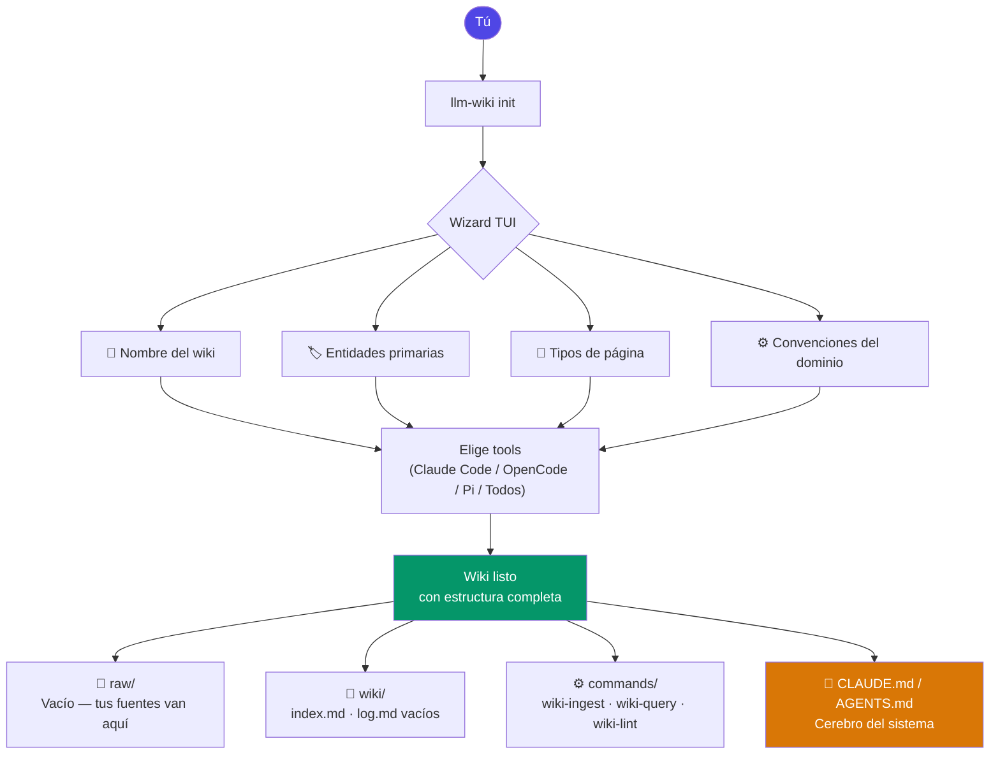
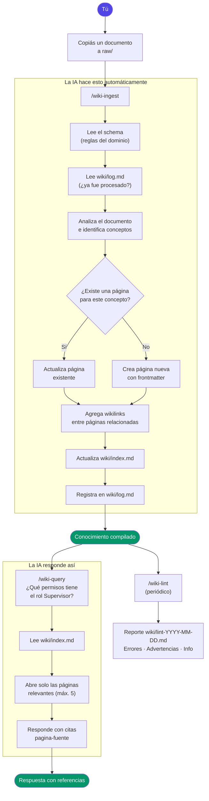

# llm-wiki

CLI + TUI para crear y gestionar wikis de conocimiento mantenidos por IA, basado en el patrón LLM Wiki de Karpathy (abril 2026).

**Un comando crea tu wiki. La IA lo mantiene. El conocimiento se acumula.**

---

## Instalación

### Homebrew (recomendado)

```bash
brew tap DavDaz/llm-wiki
brew install llm-wiki
```

### Go install

```bash
go install github.com/DavDaz/llm-wiki-generator/cmd/llm-wiki@latest
```

---

## Crear un wiki nuevo

```bash
# TUI interactivo (recomendado)
llm-wiki init

# Modo headless con flags
llm-wiki init --name "MIDES RENAB" --slug mides-renab --tools claude-code,opencode
llm-wiki init --name "Legal Wiki" --slug legal-wiki --tools all --entities "usuario,rol,permiso"
```

El wizard TUI te guía por estos pasos:

1. **Nombre y slug** — identificador técnico del wiki (kebab-case)
2. **Idioma** — `es` o `en`
3. **Tools** — Claude Code, OpenCode, Pi (o todos)
4. **Entidades primarias** — los sustantivos centrales de tu dominio
5. **Tipos de página** — taxonomía del wiki (pre-cargado con defaults editables)
6. **Convenciones** — reglas de negocio que la IA debe aplicar siempre

Al terminar tenés un directorio listo con `CLAUDE.md` / `AGENTS.md` configurado para tu dominio, estructura `raw/` y `wiki/`, y los skills `/wiki-ingest`, `/wiki-query`, `/wiki-lint`.

---

## Gestionar un wiki existente

```bash
# Abre el dashboard TUI (toggle de tools, migrate)
cd tu-wiki/
llm-wiki manage
# o simplemente:
llm-wiki
```

### Comandos headless

```bash
llm-wiki status                   # estado del wiki y tools instalados
llm-wiki add-tool opencode        # habilitar un tool backend
llm-wiki remove-tool pi           # deshabilitar un tool backend
llm-wiki migrate                  # aplicar cambios del manifest al filesystem
```

---

## Cómo funciona

### Primera vez — Crear wiki



### Flujo continuo — Agregar conocimiento y consultar



---

## Agente local con Ollama (opcional)

Si usás **OpenCode o Pi con Ollama**, podés crear un modelo especializado que ya sabe exactamente cómo operar el wiki — sin tener que explicarle nada cada vez que lo abrís.

```bash
# Requiere Ollama con gpt-oss:20b descargado
ollama create gpt-oss-wiki-agent -f ollama/wiki-agent.modelfile
```

El modelo tiene el sistema de instrucciones del wiki integrado: sabe que si le hacés una pregunta sobre el dominio tiene que ejecutar `/wiki-query`, si le decís que hay un archivo en `raw/` ejecuta `/wiki-ingest`, si pedís una auditoría ejecuta `/wiki-lint`. Rechaza cualquier consulta fuera del scope del wiki.

**Verificar que quedó bien:**

```bash
ollama show gpt-oss-wiki-agent
# Capabilities: completion · tools · thinking ✓
```

**Usar con OpenCode o Pi:**

Apuntá el tool al modelo `gpt-oss-wiki-agent` en tu configuración de Ollama. Los comandos en `.opencode/commands/` y `.pi/prompts/` funcionan igual — el sistema prompt del Modelfile amplía lo que el agente ya sabe.

> Ver `ollama/wiki-agent.modelfile` para el sistema prompt completo y los parámetros.

---

## Flujo de trabajo diario

### Agregar conocimiento nuevo

```bash
cp mi-manual.pdf tu-wiki/raw/

# En Claude Code, OpenCode o Pi:
/wiki-ingest
```

### Hacer preguntas

```bash
# En Claude Code, OpenCode o Pi:
/wiki-query ¿qué permisos tiene el rol Supervisor?
/wiki-query ¿cómo se registra un beneficiario nuevo?
```

### Auditar el wiki

```bash
# En Claude Code, OpenCode o Pi:
/wiki-lint
```

---

## Archivos clave generados

### `CLAUDE.md` / `AGENTS.md`

El schema del dominio — el archivo más importante. Define entidades, tipos de página, reglas de nomenclatura y convenciones. La IA lo lee antes de cualquier operación.

- `CLAUDE.md` si usás Claude Code
- `AGENTS.md` si usás OpenCode o Pi
- Ambos si usás múltiples tools

### `wiki/index.md`

Catálogo central. Una línea por página. La IA lo lee primero en cada query.

### `wiki/log.md`

Historial append-only de todas las operaciones. Sirve para saber qué fuentes ya fueron procesadas.

---

## Estructura de una página wiki

```markdown
---
tipo: proceso
titulo: Crear Usuario
dominio: mides-renab
status: vigente
confianza: alta
fuentes: [raw/manual-usuarios-v2.pdf]
actualizado: 2026-04-21
---

# Crear Usuario

## Precondiciones

- El solicitante debe tener rol [[rol-administrador]]

## Pasos

1. ...

## Ver también

- [[asignar-rol]]
- [[politica-acceso]]
```

---

## Cuándo usar este patrón

✅ **Ideal para:**
- Documentación de sistemas internos (hasta ~200 artículos)
- Knowledge base de equipos pequeños (2-10 personas)
- Procesos, roles, permisos, manuales operativos

⚠️ **Considerá RAG si:**
- Tenés miles de documentos que cambian constantemente
- Necesitás búsqueda semántica sobre texto libre masivo

---

## Basado en

- [Andrej Karpathy — LLM Wiki (abril 2026)](https://gist.github.com/karpathy/442a6bf555914893e9891c11519de94f)
- [LLM Wiki v2 — lessons from production](https://gist.github.com/rohitg00/2067ab416f7bbe447c1977edaaa681e2)
- [agentskills.io open standard](https://agentskills.io)
